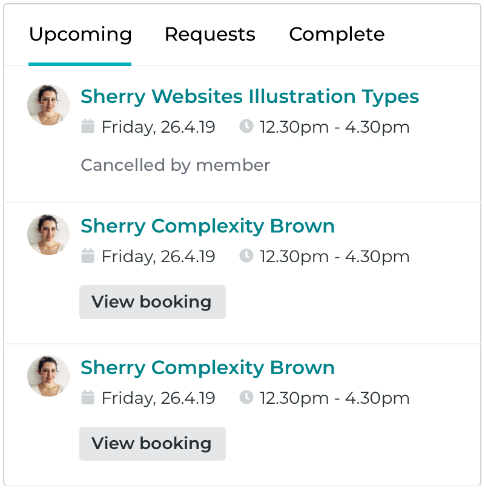

# Home Care Heroes Tech Test

Create booking section React Component according the design and requirements.

## Requirements

1. Use ECMAScript 6+.
2. Create your own data in a suitable format and structure.
3. Should be maximum 3 items in each tab (Upcoming, Requests, Complete)
4. When user clicks a tab should display items accordingly
5. Use material-ui.com library for UI components.
6. Use React Hooks useState for state storage.
7. Should have Unit Tests using Mocha/Chai and Enzyme.
8. Should have no testing or Eslint Errors.
9. Add your code inside `src/components/Bookings.jsx`
10. Create your own branch and push it when work is ready

## Using Template

`npm start` - running app

`npm test` - running unit tests

`npm run lint` - running lint checking

## Design

